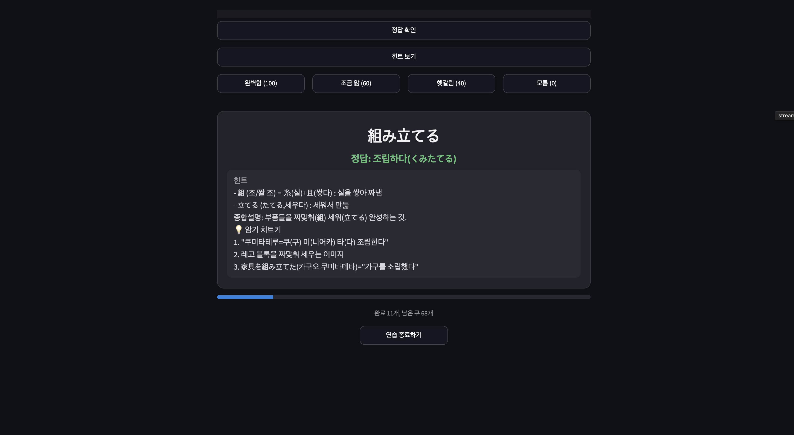
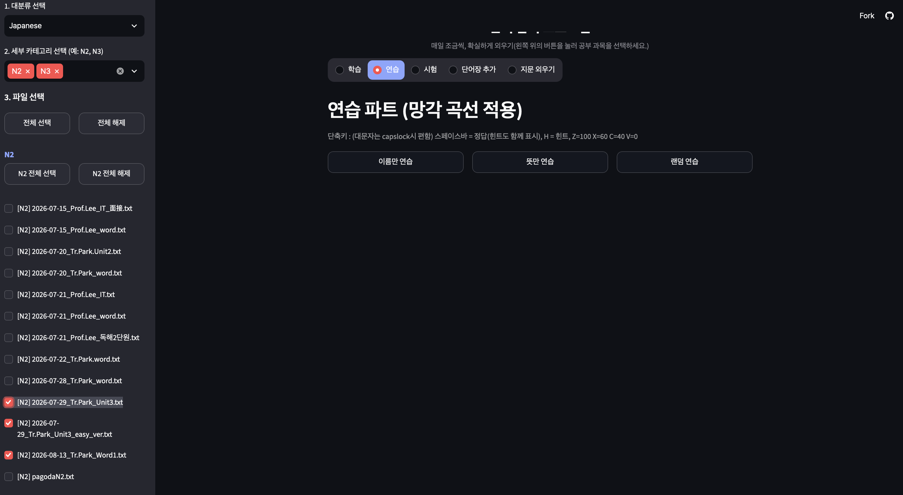
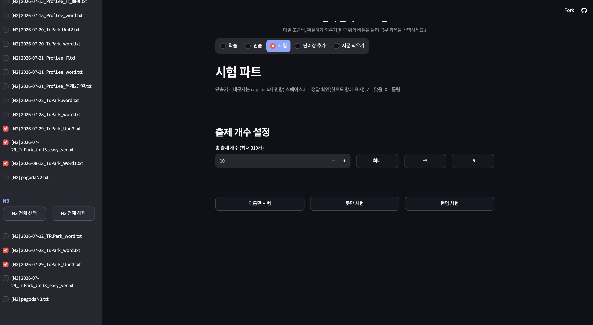
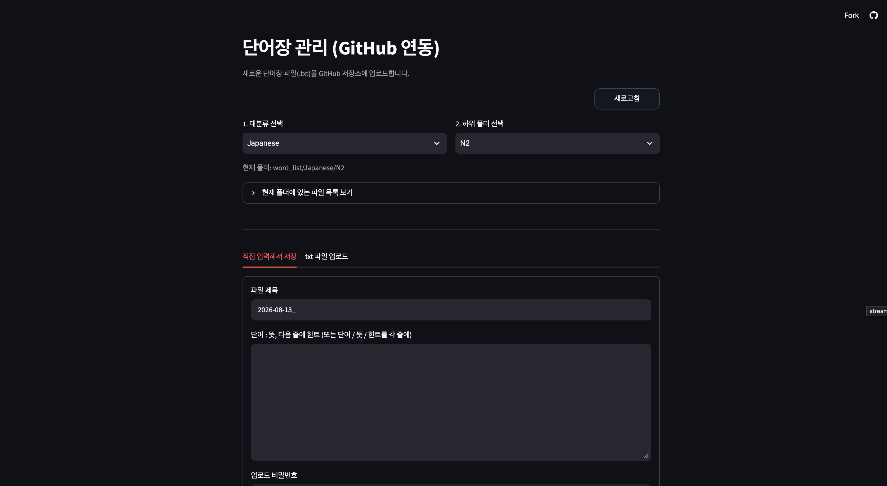

# 単語暗記アプリ — 忘却曲線ベースの学習 Web アプリ (プロトタイプ)
### 단어 암기 프로그램 — 망각 곡선 기반 학습 웹앱 (프로토타입)

> K-Move 研修の同期が漢字の暗記に苦労しているのを見て制作した Streamlit 学習ツール。
> **GitHub リポジトリをそのままデータベースとして利用**し、専用サーバーなしで単語帳の追加や進捗保存まで処理します。
>
> K-Move 연수 동기들이 한자 암기에 어려움을 겪는 것을 보고 만든 Streamlit 학습 도구.
> **GitHub 저장소를 그대로 데이터베이스로 사용**하여, 별도 서버 없이 단어장 추가·진행 상황 저장까지 처리합니다.


これは後継プロジェクト [word_app](https://github.com/YSHHAN36565362/word_app) の
プロトタイプ(旧バージョン)です。現在は Next.js + PWA 版の word_app を開発・運用して
います。最新版: [github.com/YSHHAN36565362/word_app](https://github.com/YSHHAN36565362/word_app)
(デモ: [wordapp-puce.vercel.app](https://wordapp-puce.vercel.app))

이 프로젝트는 후속작 [word_app](https://github.com/YSHHAN36565362/word_app)의
프로토타입(구버전)입니다. 현재는 Next.js + PWA 버전인 word_app을 개발·운영하고
있습니다. 최신 버전: [github.com/YSHHAN36565362/word_app](https://github.com/YSHHAN36565362/word_app)
(데모: [wordapp-puce.vercel.app](https://wordapp-puce.vercel.app))

このREADMEは上から日本語、その後に韓国語で同じ内容を記載しています。 /
이 README는 위에서부터 일본어, 그 아래에 같은 내용을 한국어로 다시 정리했습니다.

---

## 日本語

### 制作のきっかけ

K-Move の日本IT研修で、多くの研修生が漢字の暗記に苦労していました。放課後に一緒に
復習をしていたとき、ある研修生が「同じ漢字を何度覚えても、翌日には忘れてしまう」と
漏らしたのが出発点です。

最初は単純な単語リストを作って共有しました。しかしすぐに限界が見えました。成り立ち
(語源)と例文がなければ結局記憶に残らないこと、そして一度覚えた単語をいつ再び見るべき
かを誰も管理できていないことです。

そこで二つを自作しました。

1. LLM で漢字の成り立ち・例文・暗記のコツを生成し、単語帳を自動的に充実させる流れ
2. 自己評価に応じて再出現のタイミングが変わる忘却曲線キュー

その後、情報処理技士(정보처리기사)実技の勉強にも同じツールを使うようになり、日本語
専用ではなくテキストファイルさえ入れればどの科目でも動く汎用の暗記ツールへ拡張しました。

| 項目 | 内容 |
|---|---|
| 開発時期 | 2026年 (K-Move 日本Java専門家育成課程受講中) |
| 種別 | 個人プロジェクト (実利用目的) |
| メインコード | [`app.py`](./app.py) (約1,550行) |
| 実行形態 | Streamlit Webアプリ |
| データストア | GitHubリポジトリ (Contents API) |
| 現在の収録内容 | 日本語N2 13件・N3 5件・情報処理技士実技 4ファイル |
| 最新版 | [word_app](https://github.com/YSHHAN36565362/word_app) — Next.js + PWA版、同じデータ/ロジックを継承 |

---

### 5つの学習モード

上部のラジオボタンでモードを切り替えます。すべてのモードはサイドバーで選んだファイル
の組み合わせをそのまま使います。

| # | モード | 説明 |
|---|---|---|
| 1 | 学習 | 単語を順番にめくりながら一通り確認する1周モード。スペースバーで次の単語、`H`でヒント |
| 2 | 練習 | 忘却曲線キューを適用。自己評価(100/60/40/0)に応じて再出現のタイミングが変わる |
| 3 | 試験 | 出題数を指定して正答率を測定。`Z`=正解、`X`=不正解 |
| 4 | 単語帳の追加 | Web上で直接入力するかtxtをアップロードしてGitHubリポジトリにコミット |
| 5 | 文章の暗記 | 会話文・読解文を一文ずつめくりながら暗唱 |

---

### 中核 — 忘却曲線キュー

このアプリで最も力を入れた部分です。よくある単語帳アプリは「正解 / 不正解」の二択
ですが、実際の暗記はそれほど二分法的ではありません。「見れば分かるが、すぐには出て
こない」といった中間状態が存在します。

そこで自己評価を4段階に分け、それぞれキューのどの位置に再挿入するかを変えて設計しました。

| 評価 | 点数 | 再挿入位置 | 意味 |
|---|---:|---|---|
| 完璧 | 100 | キューから除外 | 今回のセッションでは再出題されない |
| 少し分かる | 60 | 残りキューの50–80%地点 | しばらく経ってから再登場 |
| 曖昧 | 40 | 残りキューの20–40%地点 | 中盤あたりで再登場 |
| 分からない | 0 | 残りキューの5–15%地点 | すぐに再登場 |

```python
def requeue_position(queue_len: int, level: int) -> int:
    if queue_len <= 1:
        return 0
    ranges = {60: (0.5, 0.8), 40: (0.2, 0.4), 0: (0.05, 0.15)}
    lo, hi = ranges[level]
    lo_idx = max(0, int(queue_len * lo))
    hi_idx = max(lo_idx, int(queue_len * hi))
    return get_session_rng().randint(lo_idx, hi_idx)
```

二つの設計意図があります。

- 固定値ではなく区間からランダムに選びます。位置を固定するとユーザーが順番を覚えて
  しまい、単語ではなく「順番」を記憶してしまいます。毎回わずかに揺らすことでこれを
  防いでいます。
- 絶対数ではなくキュー長に対する比率で計算します。残りが10語のときと300語のときで、
  「5〜15%後」の体感が自然に変わります。



上の画面は実際の練習中の様子です。正解と併せて漢字を部首単位に分解したヒントと、
LLMが生成した暗記のコツが表示されます。下部には進捗と残りキュー数がリアルタイムで
更新されます。

---

### 画面

#### 練習パート — ファイル選択

大分類 → 詳細カテゴリ → ファイルの複数選択、と絞り込みます。複数ファイルを同時に
選んで一つのキューに統合できるため、「N2 3ファイル + N3 2ファイル」といった組み合わせ
学習が可能です。



#### 試験パート

選択したファイルの総単語数を上限として出題数を指定します(スクリーンショットでは
最大319件)。「最大」/「+5」/「-5」ボタンで素早く調整できます。



#### 単語帳の管理(GitHub連携)

アプリ内で単語帳を作成し、そのままGitHubリポジトリへコミットします。直接入力と
txtアップロードの両方に対応し、ファイル名には本日の日付が自動で付きます。



---

### GitHubをデータベースとして

個人用の学習ツールにDBサーバーを別途立てるのは過剰です。そこでGitHub Contents API
をデータ層として使いました。

| 機能 | 実装 |
|---|---|
| 単語帳の一覧取得 | `GET /contents/{path}` — フォルダ構成をそのままカテゴリとして使用 |
| 単語帳の読み込み | `GET` + base64デコード |
| 単語帳の追加・更新 | `PUT /contents/{path}` — 既存ファイルは先にSHAを取得してから上書き |
| 単語帳の削除 | `DELETE /contents/{path}` |
| 進捗の保存 | `progress_logs/{マイ番号}/{part}.json` としてコミット |

この方式の利点は明確でした。

- バージョン管理が無料で付いてきます。単語帳を誤って編集してもコミット履歴から
  戻せます。
- インフラ費用がゼロです。Streamlit Community Cloud + GitHubの組み合わせでサーバー
  レスに運用できます。
- 同期との共有が容易です。リポジトリをForkすれば各自の単語帳を持てます。

一方で限界もあります。APIのレート制限があるため`@st.cache_data`でキャッシュし、
書き込み後は明示的にキャッシュをクリアする処理を入れました。同時書き込みが頻繁な
用途にはこの構成は向きません。

#### 進捗の保存 —「マイ番号」

ログイン機能を付けると重くなります。代わりに、ユーザーが任意の数字を一つ入力すれば
それを識別子として進捗を保存する方式にしました。番号を入力しなくても学習自体は問題
なく動作します。

入力値は`sanitize_user_id()`で英数字・`_`・`-`のみを残し40文字に切り詰め、パス
トラバーサルを防いでいます。また保存に失敗しても学習が止まらないように例外を握り
つぶして`False`を返すようにしました。ネットワークが一瞬切れただけで勉強中の画面が
飛ぶのは避けたかったためです。

---

### 単語帳のファイル形式

人が手で書きやすいことを最優先にしました。二つの形式の両方を許容し、パーサが自動で
判別します。

形式A — コロン区切り

```
組み立てる : 조립하다(くみたてる)
- 組 (조/짤 조) = 糸(실)+且(쌓다) : 실을 쌓아 짜냄
- 立てる (たてる,세우다) : 세워서 만듦
종합설명: 부품들을 짜맞춰(組) 세워(立てる) 완성하는 것.
암기 치트키
1. "쿠미타테루=쿠(구) 미(니어카) 타(다) 조립한다"
2. 레고 블록을 짜맞춰 세우는 이미지
```

形式B — 行区切り

```
組み立てる
조립하다(くみたてる)
(3行目以降がヒント)
```

空行がブロックの区切りです。1行目に`:`があれば形式A、なければ形式Bとして処理し、
3行目以降はすべてヒントとしてまとめます。全角コロン(`：`)も半角に正規化し、
`(単語, 意味, ヒント)`の3要素がすべて一致する項目は自動で重複排除します。

ヒント部分はLLMに生成させてそのまま貼り付ける前提で設計しています。リポジトリの
`prompt japanese.txt` / `prompt IT.txt` がその際に使ったプロンプトです。

---

### 使い勝手のために入れたもの

実際に毎日使う道具なので、学習の流れが途切れる箇所を一つずつ潰すことに多くの時間を
使いました。

| 機能 | 理由 |
|---|---|
| キーボードショートカット — スペース(次へ/正解確認)、`H`(ヒント)、`Z`/`X`/`C`/`V`(4段階評価) | マウスでボタンを探す時間が暗記のリズムを途切れさせます |
| 入力欄内ではショートカット無効 | 単語を入力中にスペースを押して画面が進んでしまう事故を防ぐため |
| 90秒周期のセッションkeep-aliveピング | 画面を見るだけでボタンを押さないとサーバーがセッションを整理し、進捗が消えていました |
| フォントサイズ調整 + ダーク/ライト切替 | スマートフォンで文字が小さく読みにくいというフィードバックを反映 |
| 下部固定アクションバー(sticky bar) | モバイルでボタンを探してスクロールしなくて済むように |
| 集中モード(Focus mode) | 学習が始まるとサイドバーを畳んで画面を広く使います |
| 現在の学習ファイルバナー | 複数ファイルを合わせて学習するとき、何を見ているか見失わないように |

keep-aliveは実際に遭遇した問題から生まれました。単語を長く見つめてからボタンを押す
とセッションが初期化され、最初からやり直しになっていました。ブラウザが90秒ごとに
信号を送るようにし、30分間で最低20回以上届くようにしています。

---

### フォルダ構成

```
word_test/
├── app.py                      # Streamlitメインアプリ
├── requirements.txt
├── .streamlit/config.toml      # テーマ設定
├── word_list/                  # 単語帳データ(=DB)
│   ├── Japanese/
│   │   ├── N2/                 # 13ファイル
│   │   └── N3/                 #  5ファイル
│   └── _IT/                    # 情報処理技士実技 4ファイル
├── progress_logs/              # ユーザー別の進捗JSON
│   └── {マイ番号}/{part}.json
├── prompt japanese.txt         # 日本語ヒント生成用LLMプロンプト
├── prompt IT.txt               # 情報処理技士ヒント生成用LLMプロンプト
└── images/                     # README用スクリーンショット
```

---

### 実行方法

```bash
# 1. 依存関係のインストール
pip install -r requirements.txt

# 2. シークレットの設定
#    .streamlit/secrets.toml
#    github_token    = "ghp_..."     # repo 権限が必要
#    github_repo     = "USER/REPO"
#    upload_password = "..."         # 単語帳アップロード・削除保護用

# 3. 実行
streamlit run app.py
```

GitHubトークンがなくてもローカルの`word_list/`を読み込んで学習・練習・試験・文章
モードは動作します。単語帳の追加と進捗保存のみが無効になります。

`secrets.toml`は絶対にコミットしないでください。アップロード・削除機能は
`hmac.compare_digest`でパスワードを検証しています。

---

### 学んだこと

- 最良の要件定義は、自分が味わった不便である。セッションが切れて最初からやり直し、
  スマホで文字が見えない、ボタンの位置が毎回変わって戸惑う — 機能リストの多くは実際に
  イライラした瞬間から生まれました。ユーザーが自分自身であることが開発速度を大きく
  高めました。
- 使う人の言葉は機能仕様に翻訳しなければならない。「文字が小さくて読みにくい」→
  フォント倍率の調整ボタン、「ボタンを押すたびに位置が変わって戸惑う」→ 移動ボタンの
  上部固定。不満をそのまま書き写すのではなく、その背後の原因を探して設計に変える
  過程こそが開発の本体でした。
- 正解/不正解の二択では暗記の実態を捉えられない。4段階の自己評価と比率ベースの
  再挿入に変えて初めて、「曖昧に覚えている単語」が適切な間隔で戻ってくるように
  なりました。
- インフラを増やさずに問題を解く方法がある。DBを立てる代わりにGitHub APIをデータ層
  として使った選択は、個人プロジェクトの制約(費用・運用負担)の中でバージョン管理
  まで手に入れる結果につながりました。

---

### 今後の改善

このプロジェクト(プロトタイプ)を開発していた時点での課題です。

- 現在の忘却曲線はセッション内でのみ機能します。「昨日間違えた単語」を今日優先的に
  出題するには単語単位の学習履歴を蓄積する必要があり、SM-2のような正式な間隔反復
  アルゴリズムの導入を検討していました。
- 誤答ノートの自動生成(試験で間違えた単語だけを集めて新しい単語帳としてコミット)
- ヒント生成LLM呼び出しのアプリ内統合(現在は外部で生成して貼り付け)
- 学習統計ダッシュボード(日別の学習量、正答率の推移)

これらの項目は、後継の [word_app](https://github.com/YSHHAN36565362/word_app) で
実際に実装されました — 単語ごとの習熟度の永続保存、誤答ノート、学習統計ダッシュボード、
学習ダッシュボード上での再開機能です。

---

### 技術スタック

`Python` · `Streamlit` · `GitHub Contents API` · `requests` · `HTML/CSS` ·
`JavaScript (components.html)` · `hmac` · `zoneinfo`

---

## 한국어

### 만들게 된 계기

K-Move 일본 IT 연수 과정에서, 많은 연수생이 한자 암기에 어려움을 겪고 있었습니다.
방과 후 함께 복습을 하던 중 한 연수생이 "같은 한자를 몇 번을 외워도 다음 날이면
잊어버린다"고 말한 것이 시작이었습니다.

처음에는 단순한 단어 리스트를 만들어 공유했습니다. 그런데 금방 한계가 보였습니다.
성립(어원)과 예문이 없으면 결국 기억에 남지 않는다는 것, 그리고 한 번 외운 단어를
언제 다시 봐야 하는지를 아무도 관리하지 못한다는 것이었습니다.

그래서 두 가지를 직접 만들었습니다.

1. LLM으로 한자의 성립·예문·암기 치트키를 생성해 단어장을 자동으로 살찌우는 흐름
2. 자기 평가에 따라 다시 등장하는 시점이 달라지는 망각 곡선 큐

이후 정보처리기사 실기 준비까지 같은 도구로 하게 되면서, 일본어 전용이 아니라 어떤
과목이든 텍스트 파일만 넣으면 동작하는 범용 암기 도구로 확장했습니다.

| 항목 | 내용 |
|---|---|
| 개발 시기 | 2026년 (K-Move 일본 Java 전문가 육성과정 수강 중) |
| 유형 | 개인 프로젝트 (실사용 목적) |
| 메인 코드 | [`app.py`](./app.py) (약 1,550 lines) |
| 실행 형태 | Streamlit 웹 애플리케이션 |
| 데이터 저장소 | GitHub 저장소 (Contents API) |
| 현재 수록 | 일본어 N2 13개 · N3 5개 · 정보처리기사 실기 4개 파일 |
| 최신 버전 | [word_app](https://github.com/YSHHAN36565362/word_app) — Next.js + PWA 버전, 같은 데이터/로직을 계승 |

---

### 5개 학습 모드

상단 라디오 버튼으로 모드를 전환합니다. 모든 모드는 사이드바에서 고른 파일 조합을
그대로 사용합니다.

| # | 모드 | 설명 |
|---|---|---|
| 1 | 학습 | 단어를 순서대로 넘기며 훑어보는 1회독 모드. 스페이스바로 다음 단어, `H`로 힌트 |
| 2 | 연습 | 망각 곡선 큐 적용. 자기 평가(100/60/40/0)에 따라 재등장 시점이 달라짐 |
| 3 | 시험 | 출제 개수를 지정해 정답률을 측정. `Z`=맞음, `X`=틀림 |
| 4 | 단어장 추가 | 웹에서 직접 입력하거나 txt를 올려 GitHub 저장소에 커밋 |
| 5 | 지문 외우기 | 회화문·독해 지문을 한 문장씩 넘기며 암송 |

---

### 핵심 — 망각 곡선 큐

이 앱에서 가장 공을 들인 부분입니다. 흔한 단어장 앱은 「맞음 / 틀림」 2지선다지만,
실제 암기는 그렇게 이분법적이지 않습니다. "보면 알겠는데 바로는 안 나온다" 같은
중간 상태가 존재합니다.

그래서 자기 평가를 4단계로 나누고, 각 단계마다 큐의 어느 위치에 다시 꽂아 넣을지를
다르게 설계했습니다.

| 평가 | 점수 | 재삽입 위치 | 의미 |
|---|---:|---|---|
| 완벽함 | 100 | 큐에서 제거 | 이번 세션에서 다시 안 나옴 |
| 조금 앎 | 60 | 남은 큐의 50–80% 지점 | 한참 뒤에 다시 |
| 헷갈림 | 40 | 남은 큐의 20–40% 지점 | 중간쯤에 다시 |
| 모름 | 0 | 남은 큐의 5–15% 지점 | 곧바로 다시 |

```python
def requeue_position(queue_len: int, level: int) -> int:
    if queue_len <= 1:
        return 0
    ranges = {60: (0.5, 0.8), 40: (0.2, 0.4), 0: (0.05, 0.15)}
    lo, hi = ranges[level]
    lo_idx = max(0, int(queue_len * lo))
    hi_idx = max(lo_idx, int(queue_len * hi))
    return get_session_rng().randint(lo_idx, hi_idx)
```

두 가지 설계 의도가 있습니다.

- 고정값이 아니라 구간에서 무작위로 뽑습니다. 위치를 고정하면 사용자가 순서를
  외워버려서, 단어가 아니라 「순서」를 기억하게 됩니다. 매번 조금씩 흔들어 이를
  막았습니다.
- 절대 개수가 아니라 큐 길이의 비율로 계산합니다. 남은 단어가 10개일 때와 300개일
  때 "5~15% 뒤"의 체감이 자연스럽게 달라집니다.


위 화면은 실제 연습 중 모습입니다. 정답과 함께 한자를 부수 단위로 분해한 힌트와
LLM이 생성한 암기 치트키가 표시됩니다. 하단에는 진행률과 남은 큐 개수가 실시간으로
갱신됩니다.

---

### 화면

#### 연습 파트 — 파일 선택

대분류(Japanese / \_IT) → 세부 카테고리(N2, N3 …) → 파일 다중 선택 순으로 좁혀
들어갑니다. 여러 파일을 동시에 골라 하나의 큐로 합칠 수 있어서, 「N2 3개 + N3 2개」
같은 조합 학습이 가능합니다.


#### 시험 파트

선택한 파일들의 전체 단어 수를 상한으로 출제 개수를 지정합니다(스크린샷 기준 최대
319개). `최대` / `+5` / `-5` 버튼으로 빠르게 조절할 수 있습니다.


#### 단어장 관리 (GitHub 연동)

앱 안에서 바로 단어장을 만들어 GitHub 저장소에 커밋합니다. 직접 입력 방식과 txt
업로드 방식을 모두 지원하며, 파일 제목에는 오늘 날짜가 자동으로 붙습니다.


---

### GitHub을 데이터베이스로

개인 학습 도구에 DB 서버를 따로 띄우는 것은 과합니다. 그래서 GitHub Contents API를
데이터 계층으로 사용했습니다.

| 기능 | 구현 |
|---|---|
| 단어장 목록 조회 | `GET /contents/{path}` — 폴더 구조를 그대로 카테고리로 사용 |
| 단어장 읽기 | `GET` + base64 디코드 |
| 단어장 추가·수정 | `PUT /contents/{path}` — 기존 파일은 SHA를 먼저 조회해 덮어쓰기 |
| 단어장 삭제 | `DELETE /contents/{path}` |
| 진행 상황 저장 | `progress_logs/{내번호}/{part}.json` 으로 커밋 |

이 방식의 장점은 명확했습니다.

- 버전 관리가 공짜로 따라옵니다. 단어장을 잘못 고쳐도 커밋 히스토리로 되돌릴 수
  있습니다.
- 인프라 비용이 0원입니다. Streamlit Community Cloud + GitHub 조합으로 서버 없이
  운영됩니다.
- 동기들과 공유가 쉽습니다. 저장소를 Fork 하면 각자의 단어장을 갖게 됩니다.

한편 한계도 있습니다. API 호출 제한(rate limit)이 있어 `@st.cache_data` 로 캐싱을
걸었고, 쓰기 작업 후에는 명시적으로 캐시를 비우도록 처리했습니다. 동시 쓰기가
잦아지면 이 구조는 맞지 않습니다.

#### 진행 상황 저장 — 「내 번호」

로그인 기능을 붙이면 무거워집니다. 대신 사용자가 아무 숫자나 하나 입력하면 그것을
식별자로 삼아 진행 상황을 저장하는 방식을 택했습니다. 번호를 입력하지 않아도 학습
자체는 그대로 동작합니다.

입력값은 `sanitize_user_id()` 로 영숫자·`_`·`-` 만 남기고 40자로 잘라, 경로 조작
(path traversal)을 차단합니다. 또한 저장에 실패해도 학습이 멈추지 않도록 예외를
삼키고 `False` 만 반환하도록 했습니다. 네트워크가 잠깐 끊겼다고 공부하던 화면이
날아가면 안 되기 때문입니다.

---

### 단어장 파일 포맷

사람이 손으로 쓰기 쉬운 것을 최우선으로 했습니다. 두 가지 형식을 모두 허용하며,
파서가 자동으로 판별합니다.

형식 A — 콜론 구분

```
組み立てる : 조립하다(くみたてる)
- 組 (조/짤 조) = 糸(실)+且(쌓다) : 실을 쌓아 짜냄
- 立てる (たてる,세우다) : 세워서 만듦
종합설명: 부품들을 짜맞춰(組) 세워(立てる) 완성하는 것.
암기 치트키
1. "쿠미타테루=쿠(구) 미(니어카) 타(다) 조립한다"
2. 레고 블록을 짜맞춰 세우는 이미지
```

형식 B — 줄 구분

```
組み立てる
조립하다(くみたてる)
(3번째 줄부터 힌트)
```

빈 줄이 블록 구분자입니다. 첫 줄에 `:` 가 있으면 A형식, 없으면 B형식으로 처리하고,
3번째 줄부터는 전부 힌트로 묶습니다. 전각 콜론(`：`)도 반각으로 정규화하고,
`(단어, 뜻, 힌트)` 3요소가 모두 같은 항목은 자동으로 중복 제거합니다.

힌트 부분은 LLM에게 생성시킨 뒤 그대로 붙여 넣는 것을 전제로 설계했습니다. 저장소의
`prompt japanese.txt`, `prompt IT.txt` 가 그때 사용한 프롬프트입니다.

---

### 사용성을 위해 넣은 것들

실제로 매일 쓰는 도구이다 보니, 학습 흐름이 끊기는 지점을 하나씩 없애는 데 시간을
많이 썼습니다.

| 기능 | 이유 |
|---|---|
| 키보드 단축키 — 스페이스(다음/정답), `H`(힌트), `Z`/`X`/`C`/`V`(4단계 평가) | 마우스로 버튼을 찾는 시간이 암기 리듬을 끊습니다 |
| 입력창 안에서는 단축키 비활성 | 단어를 입력하다 스페이스를 눌렀는데 화면이 넘어가는 사고를 막기 위해 |
| 90초 주기 세션 keep-alive ping | 화면만 보고 버튼을 안 누르면 서버가 세션을 정리해 진행 상황이 날아갔습니다 |
| 폰트 크기 조절 + 다크/라이트 전환 | 스마트폰에서 글자가 작아 읽기 힘들다는 피드백을 반영 |
| 하단 고정 액션 바 (sticky bar) | 모바일에서 버튼을 찾아 스크롤하지 않도록 |
| 집중 모드 (Focus mode) | 학습이 시작되면 사이드바를 접어 화면을 비웁니다 |
| 현재 학습 파일 배너 | 여러 파일을 합쳐 학습할 때 무엇을 보고 있는지 잊지 않도록 |

keep-alive 는 실제로 겪은 문제에서 나왔습니다. 단어를 오래 들여다보다가 버튼을
누르면 세션이 초기화되어 처음부터 다시 해야 했습니다. 브라우저가 90초마다 서버에
신호를 보내도록 해서, 30분 동안 최소 20번 이상 신호가 가도록 만들었습니다.

---

### 폴더 구조

```
word_test/
├── app.py                      # Streamlit 메인 애플리케이션
├── requirements.txt
├── .streamlit/config.toml      # 테마 설정
├── word_list/                  # 단어장 데이터 (= DB)
│   ├── Japanese/
│   │   ├── N2/                 # 13개 파일
│   │   └── N3/                 #  5개 파일
│   └── _IT/                    # 정보처리기사 실기 4개
├── progress_logs/              # 사용자별 진행 상황 JSON
│   └── {내번호}/{part}.json
├── prompt japanese.txt         # 일본어 힌트 생성용 LLM 프롬프트
├── prompt IT.txt               # 정보처리기사 힌트 생성용 LLM 프롬프트
└── images/                     # README용 스크린샷
```

---

### 실행 방법

```bash
# 1. 의존성 설치
pip install -r requirements.txt

# 2. 시크릿 설정
#    .streamlit/secrets.toml
#    github_token    = "ghp_..."     # repo 권한 필요
#    github_repo     = "USER/REPO"
#    upload_password = "..."         # 단어장 업로드·삭제 보호용

# 3. 실행
streamlit run app.py
```

GitHub 토큰이 없어도 로컬 `word_list/` 를 읽어 학습·연습·시험·지문 모드는 동작합니다.
단어장 추가와 진행 상황 저장 기능만 비활성화됩니다.

`secrets.toml` 은 절대 커밋하지 마세요. 업로드·삭제 기능은 `hmac.compare_digest` 로
비밀번호를 검증합니다.

---

### 배운 점

- 가장 좋은 요구사항은 내가 겪은 불편이다. 세션이 끊겨 처음부터 다시 하고, 스마트폰
  에서 글자가 안 보이고, 버튼 위치가 매번 바뀌어 헷갈리고 — 기능 목록의 상당수가
  실제로 짜증났던 순간에서 나왔습니다. 사용자가 곧 나 자신이라는 점이 개발 속도를
  크게 높였습니다.
- 쓰는 사람의 말은 기능 명세로 번역해야 한다. "글자가 작아서 읽기 힘들다" → 폰트
  배율 조절 버튼, "버튼을 누를 때마다 위치가 바뀌어 혼란스럽다" → 이동 버튼 상단
  고정. 불만을 그대로 받아 적는 것이 아니라, 그 뒤의 원인을 찾아 설계로 바꾸는
  과정이 개발의 본체였습니다.
- 정답/오답 2지선다는 암기의 실제를 담지 못한다. 4단계 자기 평가와 비율 기반
  재삽입으로 바꾸고 나서야 「애매하게 아는 단어」가 적절한 간격으로 돌아오기
  시작했습니다.
- 인프라를 늘리지 않고 문제를 푸는 방법이 있다. DB를 세우는 대신 GitHub API를
  데이터 계층으로 쓴 선택은, 개인 프로젝트의 제약(비용·운영 부담) 안에서 버전
  관리까지 얻는 결과로 이어졌습니다.

---

### 개선 방향

이 프로젝트(프로토타입)를 개발하던 시점의 과제입니다.

- 현재 망각 곡선은 세션 안에서만 동작합니다. 「어제 틀린 단어」를 오늘 우선 출제
  하려면 단어 단위 학습 이력을 누적해야 하며, SM-2 같은 정식 간격 반복 알고리즘
  도입을 검토 중이었습니다.
- 오답 노트 자동 생성 (시험에서 틀린 단어만 모아 새 단어장으로 커밋)
- 힌트 생성 LLM 호출을 앱 안에 직접 연동 (현재는 외부에서 생성 후 붙여 넣기)
- 학습 통계 대시보드 (일자별 학습량, 정답률 추이)

이 항목들은 후속작 [word_app](https://github.com/YSHHAN36565362/word_app)에서 실제로
구현되었습니다 — 단어별 숙련도 영구 저장, 오답 노트, 학습 통계 대시보드, 학습
대시보드 위에서의 이어하기 기능입니다.

---

### 기술 스택

`Python` · `Streamlit` · `GitHub Contents API` · `requests` · `HTML/CSS` ·
`JavaScript (components.html)` · `hmac` · `zoneinfo`
