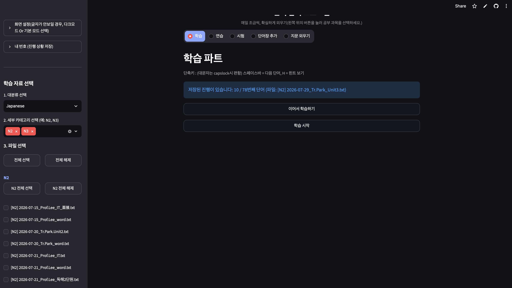
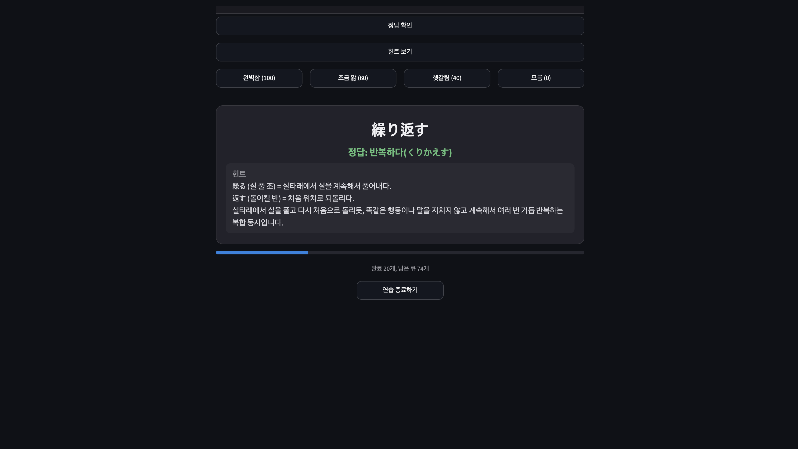
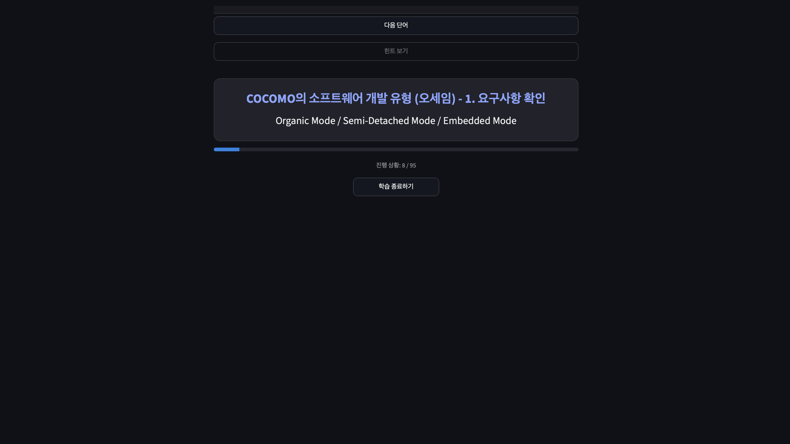

# KMOVE 単語アプリ — 語彙・資格試験暗記Webアプリ

KMOVE(海外就業研修)過程中に単語暗記に苦労する研修生のためのStreamlitベースの暗記Webアプリです。当初は日本語語彙の暗記用として企画しましたが、カテゴリ別にファイルを分類できる構造を活かし、**情報処理技士(정보처리기사)資格試験の概念・用語・問題演習**にも同じアプリを拡張して活用しています。学習・練習・試験・文章暗記の4つのモードで反復学習を支援し、別個のデータベースを使わずに**GitHubリポジトリ自体をバックエンド**として活用し、資料の登録とユーザー別の進捗保存を実現しました。

> 本プロジェクトは個人プロジェクトとして企画・設計・実装をすべて単独で行いました。

<p align="center">
  <br>
  <sub>🏠 初期画面 — 資料選択、学習・練習・試験・単語帳追加・文章暗記のうち好きなモードを選べます。</sub>
</p>
<p align="center">
  <br>
  <sub>🔁 練習パート — 「ヒントを見る」ボタンを押すと、資料作成時にLLMを活用してあらかじめ整理した漢字の解釈・単語の使い方(日本語語彙)や概念の解説(情報処理技士)が表示され、暗記しやすくなっています。また、忘却曲線を適用し、自分自身で暗記度をチェックすると、その評価に応じて項目が待機列内の一定の位置に再配置され、効率的に暗記を続けられます。</sub>
</p>
<p align="center">
  <br>
  <sub>📖 学習パート — 初めて勉強するときに使う画面で、単語(または用語)と意味を順番に表示します。一度通過した項目は再び見られないため、テスト前の最終チェックや軽い復習に向いています。</sub>
</p>

## 1. 課題定義

このアプリは、性質は異なるものの「反復して覚える」という共通の課題を持つ2つの学習ニーズから生まれました。

- **KMOVE研修の日本語語彙**: 研修生は通常、紙の単語帳やExcelで単語を暗記しますが、複数デバイス間で進捗を追跡できず、単純な繰り返しでは知っている単語と知らない単語が区別されないという限界があります。
- **情報処理技士資格の概念・用語**: 定義や用語が多く、問題を解くだけでは体系的な暗記が難しく、間違えた概念を優先的に繰り返し復習する仕組みが必要でした。

本プロジェクトは、この2つの学習対象を**同一のアプリ・同一の反復学習ロジック**で扱えるように設計し、単語を**学習(暗記)→練習(自己評価based反復)→試験(採点)**の順に反復して提示し、進捗状況をユーザー番号ごとに自動保存することで、いつでも続きから学習できるようにしました。

## 2. 主な機能

1. **学習パート**: 単語(用語)と意味を順番に表示して暗記、ヒント表示に対応(一度通過した項目は再び見られない)
2. **練習パート(忘却曲線を適用)**: 項目を見た後、自分で「完璧/少し分かる/紛らわしい/分からない」と評価すると、評価点に応じて待機列内の再出題位置が変わる(分からないほど早く再出題される)。ヒントは資料作成時にLLMを活用してあらかじめ整理した解説(漢字の解釈・単語の使い方、または情報処理技士の概念説明)
3. **試験パート**: 出題数を指定して正解/不正解を採点し、終了時に正答率を算出
4. **単語帳追加(管理)**: 新しい単語帳・用語集を直接入力するか`.txt`ファイルでアップロードしてGitHubリポジトリに保存(パスワードでアップロード権限を保護)
5. **文章一行暗記**: 会話文・文章、または情報処理技士の定義文などを一行ずつ順番に表示し、順次暗記を支援
6. **カテゴリ別資料管理**: `大分類/小分類`構造で日本語語彙(N2、N3など)と情報処理技士(データベース、アルゴリズム、ネットワークなど)を別カテゴリとして管理し、混在せず独立して学習可能
7. **進捗保存/続きから学習**: ユーザー番号を入力すると学習/練習/試験/文章の進捗状態が自動保存され、別のデバイスからも続きから学習可能

## 3. 技術アーキテクチャ — GitHubをサーバーレスバックエンドとして活用

別個のデータベースサーバーを使わず、**GitHub Contents API**を以下2つの用途に活用しています。

- **資料リポジトリ**: `word_list/{大分類}/{小分類}/*.txt`構造で単語帳・用語集を分類・保存(例: `word_list/일본어/N2/`、`word_list/정보처리기사/데이터베이스/`)。大分類/小分類は実際のリポジトリのフォルダ構造から動的に読み込み、サイドバーの選択肢を自動生成
- **ユーザー進捗保存**: `progress_logs/{ユーザー番号}/{study|practice|exam|script}.json`に現在の進捗状態をJSONとして保存。ユーザーごとに別ファイルに書き込むため、複数人が同時接続しても互いの記録を上書きしない
- ファイル上書き時にGitHub APIが要求する`sha`値をキャッシュを経由せずリアルタイムで再取得し、「sha wasn't supplied」エラーを防ぐリトライロジックを実装
- 資料アップロードは`hmac.compare_digest`でパスワードを検証し、権限のないユーザーが共有リポジトリを任意に変更できないよう保護

## 4. 使用技術スタック

- **言語/フレームワーク**: Python、Streamlit
- **バックエンド/ストレージ**: GitHub REST API(Contents API) — DB代替
- **ネットワーキング**: requests
- **セキュリティ**: hmac(パスワード検証)、Streamlit secrets(トークン管理)
- **フロントエンドUX**: カスタムCSS(ダーク/ライトテーマ、フォントサイズ調整)、JavaScriptコンポーネント注入(セッション維持ピング、キーボードショートカット)
- **その他**: zoneinfo(韓国時間タイムスタンプ)、re(安全なファイル名/ユーザーID処理)

## 5. UXの工夫

- **セッション維持**: Streamlitのセッションが非アクティブで終了するのを防ぐため、90秒ごとにブラウザがサーバーへピングを送るJSを注入
- **キーボードショートカット**: スペースバー(次へ/正解確認)、H(ヒント)、Z/X/C/V(練習パートの自己評価100/60/40/0点)
- **フォーカスモード**: 学習/練習/試験/文章の進行中はStreamlitの上部UIを隠し、画面の集中度を高める
- **ダークモード及びフォントサイズ調整**: サイドバーから即時切り替え可能

## 6. 資料ファイル形式

```
word:meaning
hint(複数行可能)

word2
meaning2
hint2
```

- `単語:意味`の一行形式と、`単語/意味/ヒント`を改行で区切る形式の両方に対応
- 日本語語彙だけでなく、情報処理技士の用語・概念問題も同じ形式(用語:定義 + 解説ヒント)で登録可能。同じロジックで単語暗記と資格試験の概念暗記を両立
- アップロード時に形式エラー(単語または意味の欠落)を行番号と共に検証して案内
- 重複項目(単語+意味+ヒントが同一)は自動的に除去

## 7. 今後の課題

- 進捗保存をGitHub Contents APIから軽量DB(SQLite/Supabaseなど)に移行し、API呼び出し制限及びコミット履歴の汚染問題を改善
- 誤答項目の自動収集(誤答ノート)及びカテゴリ別(日本語語彙/情報処理技士など)の個人別学習統計の可視化
- 自己評価(完璧/少し分かる/紛らわしい/分からない)データを蓄積し、実際の間隔反復(SM-2など)アルゴリズムへ高度化
- 情報処理技士の過去問形式(選択肢型問題)への対応拡張、他の資格試験カテゴリへの適用

## 8. フォルダ構成

```
wordbook-app/
├── README.md
├── app.py                       # Streamlitメインアプリ
├── requirements.txt
├── .streamlit/
│   └── secrets.toml             # github_token, github_owner, github_repo, github_branch, upload_password (コミット禁止)
├── word_list/                   # 資料保存フォルダ(大分類/小分類/*.txt)
│   ├── 일본어/{N2, N3, ...}/*.txt
│   └── 정보처리기사/{데이터베이스, 알고리즘, 네트워크, ...}/*.txt
└── progress_logs/                # ユーザー別進捗JSON(アプリが自動生成)
    └── {ユーザー番号}/{study|practice|exam|script}.json
```

## 9. 実行方法

```bash
pip install -r requirements.txt
streamlit run app.py
```

`.streamlit/secrets.toml`の例(リポジトリにコミットせず`.gitignore`に追加):
```toml
github_token = "ghp_xxxxxxxxxxxxxxxx"
github_owner = "your-github-id"
github_repo = "your-repo-name"
github_branch = "main"
upload_password = "設定するパスワード"
```

---

# KMOVE 단어장 — 어휘·자격증 암기 웹앱

KMOVE(해외취업연수) 과정 중 단어 암기에 어려움을 느끼는 연수생을 위해 만든 Streamlit 기반 암기 웹앱입니다. 처음에는 일본어 어휘 암기용으로 기획했지만, 카테고리별로 자료를 분류할 수 있는 구조를 활용해 **정보처리기사 개념·용어·문제 학습**에도 같은 앱을 확장해서 쓰고 있습니다. 학습・연습・시험・지문 외우기 4가지 모드로 반복 학습을 지원하며, 별도의 데이터베이스 없이 **GitHub 저장소 자체를 백엔드**로 활용해 자료 등록과 사용자별 진행상황 저장을 구현했습니다.

> 본 프로젝트는 개인 프로젝트로 기획・설계・구현을 모두 혼자 진행했습니다.

<p align="center">
  <br>
  <sub>🏠 초기 화면 — 자료 선택, 학습・연습・시험・단어장 추가・지문 외우기 중 원하는 모드를 선택할 수 있습니다.</sub>
</p>
<p align="center">
  <br>
  <sub>🔁 연습 파트 — "힌트 보기" 버튼을 누르면, 자료 제작 시 LLM을 활용해 미리 정리해둔 설명(일본어의 경우 한자 풀이·단어 쓰임, 정보처리기사의 경우 개념 해설)이 표시되어 외우기 쉽게 도와줍니다. 또한 망각 곡선을 적용해, 스스로 암기 정도를 체크하면 그 평가에 따라 항목이 대기열 내 일정 위치로 재배치되어 효율적으로 반복 암기할 수 있습니다.</sub>
</p>
<p align="center">
  <br>
  <sub>📖 학습 파트 — 처음 공부할 때 가볍게 사용하는 화면으로, 단어(또는 용어)와 뜻을 순서대로 표시합니다. 한 번 지나간 항목은 다시 볼 수 없어서, 시험 전 최종 확인이나 가벼운 복습에 적합합니다.</sub>
</p>

## 1. 문제 정의

이 앱은 성격은 다르지만 "반복해서 외워야 한다"는 공통 과제를 가진 두 가지 학습 수요에서 출발했습니다.

- **KMOVE 연수 일본어 어휘**: 연수생들은 보통 종이 단어장이나 엑셀로 단어를 암기하는데, 여러 기기 간 진행상황 추적이 안 되고, 단순 반복만으로는 아는 단어와 모르는 단어가 구분되지 않는다는 한계가 있습니다.
- **정보처리기사 자격증 개념·용어**: 정의와 용어가 많아 문제풀이만으로는 체계적인 암기가 어렵고, 틀린 개념을 우선적으로 반복 복습하는 장치가 필요했습니다.

본 프로젝트는 이 두 학습 대상을 **동일한 앱, 동일한 반복 학습 로직**으로 다룰 수 있도록 설계했습니다. 단어를 **학습(암기) → 연습(자기평가 기반 반복) → 시험(채점)** 순서로 반복 노출시키고, 진행 상황을 사용자 번호 기준으로 자동 저장해 언제든 이어서 학습할 수 있게 만들었습니다.

## 2. 주요 기능

1. **학습 파트**: 단어(용어)와 뜻을 순서대로 보여주며 암기, 힌트 보기 지원(한 번 지나간 항목은 다시 볼 수 없음)
2. **연습 파트 (망각곡선 적용)**: 항목을 본 뒤 스스로 "완벽함/조금 앎/헷갈림/모름"으로 평가하면, 평가 점수에 따라 대기열 내 재출제 위치가 달라짐(모를수록 더 빨리 다시 나옴). 힌트는 자료 제작 시 LLM을 활용해 미리 정리한 설명(한자 풀이・단어 쓰임, 또는 정보처리기사 개념 해설)
3. **시험 파트**: 출제 개수를 지정해 정답을 맞음/틀림으로 채점하고, 종료 시 정답률을 계산
4. **단어장 추가(관리)**: 새 단어장・용어집을 직접 입력하거나 `.txt` 파일로 업로드해 GitHub 저장소에 저장(비밀번호로 업로드 권한 보호)
5. **지문 한 줄 외우기**: 대화문・지문, 또는 정보처리기사 정의문 등을 한 줄씩 순서대로 보여주며 순차 암기를 지원
6. **카테고리별 자료 관리**: `대분류/소분류` 구조로 일본어 어휘(N2, N3 등)와 정보처리기사(데이터베이스, 알고리즘, 네트워크 등)를 서로 다른 카테고리로 관리해, 섞이지 않고 독립적으로 학습 가능
7. **진행상황 저장/이어하기**: 사용자 번호를 입력하면 학습/연습/시험/지문의 진행 상태가 자동 저장되어, 다른 기기에서도 이어서 진행 가능

## 3. 기술 아키텍처 — GitHub를 서버리스 백엔드로 활용

별도의 데이터베이스 서버 없이, **GitHub Contents API**를 다음 두 가지 용도로 활용합니다.

- **자료 저장소**: `word_list/{대분류}/{소분류}/*.txt` 구조로 단어장·용어집을 분류・저장(예: `word_list/일본어/N2/`, `word_list/정보처리기사/데이터베이스/`). 대분류/소분류는 실제 저장소 폴더 구조에서 동적으로 읽어와 사이드바 선택지를 자동 생성
- **사용자 진행상황 저장소**: `progress_logs/{사용자 번호}/{학습|연습|시험|지문}.json`에 현재 진행 상태를 JSON으로 저장. 사용자마다 별도 파일을 쓰기 때문에 다수가 동시 접속해도 서로의 기록을 덮어쓰지 않음
- 파일 덮어쓰기 시 GitHub API가 요구하는 `sha` 값을 캐시를 거치지 않고 실시간으로 재조회해, "sha wasn't supplied" 오류를 방지하는 재시도 로직 포함
- 자료 업로드는 `hmac.compare_digest`로 비밀번호를 검증해, 권한 없는 사용자가 공유 저장소를 임의로 수정하지 못하도록 보호

## 4. 사용 기술 스택

- **언어/프레임워크**: Python, Streamlit
- **백엔드/저장소**: GitHub REST API(Contents API) — DB 대체
- **네트워킹**: requests
- **보안**: hmac(비밀번호 검증), Streamlit secrets(토큰 관리)
- **프론트엔드 UX**: 커스텀 CSS(다크/라이트 테마, 폰트 크기 조절), JavaScript 컴포넌트 주입(세션 유지 핑, 키보드 단축키)
- **기타**: zoneinfo(한국시간 타임스탬프), re(안전한 파일명/사용자 ID 처리)

## 5. UX 디테일

- **세션 유지**: Streamlit 세션이 사용자 비활성으로 종료되는 것을 막기 위해, 90초마다 브라우저가 서버에 핑을 보내는 JS를 주입
- **키보드 단축키**: 스페이스바(다음/정답 확인), H(힌트), Z/X/C/V(연습 파트 자기평가 100/60/40/0점)
- **포커스 모드**: 학습/연습/시험/지문 진행 중에는 Streamlit 상단 UI를 숨겨 화면 집중도를 높임
- **다크모드 및 폰트 크기 조절**: 사이드바에서 즉시 전환 가능

## 6. 자료 파일 형식

```
word:meaning
hint(여러 줄 가능)

word2
meaning2
hint2
```

- `단어:뜻` 한 줄 형식과, `단어/뜻/힌트`를 줄바꿈으로 구분하는 형식을 모두 지원
- 일본어 어휘뿐 아니라, 정보처리기사 용어・개념 문제도 같은 형식(용어:정의 + 해설 힌트)으로 등록 가능. 같은 로직으로 단어 암기와 자격증 개념 암기를 모두 지원
- 업로드 시 형식 오류(단어 또는 뜻 누락)를 줄 번호와 함께 검증해 안내
- 중복 항목(단어+뜻+힌트 동일)은 자동 제거

## 7. 향후 과제

- 진행상황 저장소를 GitHub Contents API 대신 경량 DB(SQLite/Supabase 등)로 전환해 API 호출 한도 및 커밋 히스토리 오염 문제 개선
- 오답 항목 자동 모음(오답노트) 및 카테고리별(일본어 어휘/정보처리기사 등) 개인별 학습 통계 시각화
- 자기평가(완벽함/조금 앎/헷갈림/모름) 데이터를 축적해 실제 간격 반복(SM-2 등) 알고리즘으로 고도화
- 정보처리기사 기출문제 형식(선택형 문제)에 대한 대응 확장, 다른 자격증 카테고리로의 적용

## 8. 폴더 구조

```
wordbook-app/
├── README.md
├── app.py                       # Streamlit 메인 앱
├── requirements.txt
├── .streamlit/
│   └── secrets.toml             # github_token, github_owner, github_repo, github_branch, upload_password (커밋 금지)
├── word_list/                   # 자료 저장 폴더 (대분류/소분류/*.txt)
│   ├── 일본어/{N2, N3, ...}/*.txt
│   └── 정보처리기사/{데이터베이스, 알고리즘, 네트워크, ...}/*.txt
└── progress_logs/                # 사용자별 진행상황 JSON (앱이 자동 생성)
    └── {사용자 번호}/{study|practice|exam|script}.json
```

## 9. 실행 방법

```bash
pip install -r requirements.txt
streamlit run app.py
```

`.streamlit/secrets.toml` 예시(리포지토리에 커밋하지 말고 `.gitignore`에 추가):
```toml
github_token = "ghp_xxxxxxxxxxxxxxxx"
github_owner = "your-github-id"
github_repo = "your-repo-name"
github_branch = "main"
upload_password = "설정할 비밀번호"
```
